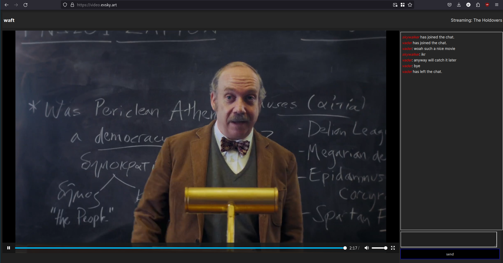

# Waft 

Single instance live stream server written in Rust.

## Features 

- [x] live chat with history
- [x] protected user access with passwords
- [ ] emoji/emotes support
- [ ] custom chat commands
- [ ] admin controls



# How to use

```shell
cargo build --release
./target/release/waft --config example.toml
```

TODO: write a dockercompose

# Thanks

- [xiu](https://github.com/harlanc/xiu)
